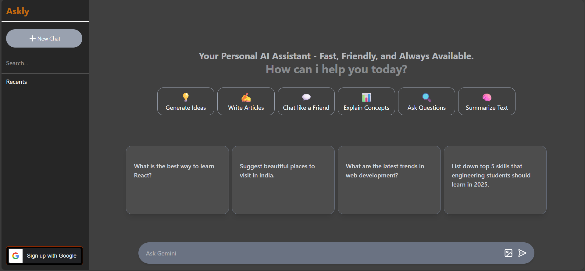

##  Askly – AI Chat App using Gemini API

**Askly** is a full-stack AI-powered chat application built with the Gemini API. It lets users chat with an AI assistant through a clean interface and secure Google OAuth login.

---

;

###  Tech Stack
- **Frontend**: React.js, Tailwind CSS  
- **Backend**: Node.js, Express  
- **Database**: MongoDB  
- **Auth**: Google OAuth  
- **AI**: Gemini API (Google)

---

### ✨ Features
- Ask AI questions and get real-time responses  
- Google login for authentication  
- Chat history per user  
- Loading indicators for better UX
